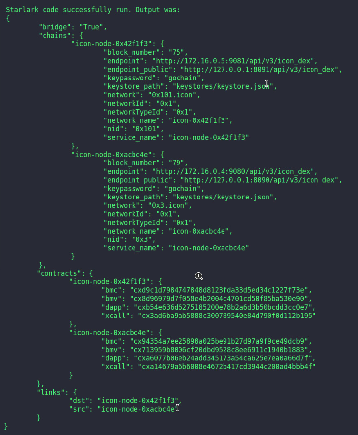
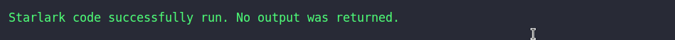

**Embark on a Revolutionary Journey into Decentralization with Our Dive Package: Unleash Your Nodes, Connect Your Chains, and Immerse Yourself in the Seamless Integration of Blockchain Technologies - Where Possibilities Know No Bounds!**

[](https://discord.gg/GyRQSBN3Cu)

# Table of Contents
- [Introduction](#introduction)
  - [About](#about)
  - [Setup and Requirements](#setup-and-requirements)
- [Integrated Chains](#integrated-chains)
- [Integrated Bridges](#integrated-bridges)
- [Configuration File Guidelines](#configuration-file-guidelines)
    - [Configuration Fields](#configuration-fields)
    - [Possible Values for Configuration Fields](#possible-values-for-configuration-fields)
    - [Example Configurations](#example-configurations)
- [Available Chains and Bridges](#available-chains-and-bridges)
    - [Chains](#chains)
    - [Bridges](#bridges)
- [Usage](#usage)
- [Dive CLI Integration](#dive-cli-integration)
- [Known Issues](#known-issues)
- [Troubleshooting](#troubleshooting)
- [Contributing](#contributing)
- [References](#references)
- [License](#license)
- [Feedback](#feedback)

# Introduction

Dive-packages, a meticulously crafted and versatile toolkit, is your key to unlocking new frontiers in blockchain exploration. Tailored for seamless integration with the Dive CLI, this powerful tool goes beyond the ordinary, offering not only an enhanced experience within Dive CLI but also standing independently as a robust solution. In addition to providing unparalleled flexibility and control in navigating decentralized landscapes, Dive-packages is a time and effort-saving companion, streamlining your journey into the future of blockchain innovation. Dive in and discover the ultimate synergy of efficiency and empowerment with our comprehensive Dive Packages.

## About

Our focus extends beyond mere node creation – Dive-packages is engineered to effortlessly facilitate the establishment of bridges between diverse blockchains. We understand the importance of interconnectedness in the decentralized landscape, and our toolkit ensures that users can effortlessly create bridges without the hassle of navigating complex setup procedures.

## Setup and Requirements

Ensure the following prerequisites are met before using the Dive-package:
- [Docker](https://www.docker.com/): Make sure Docker is installed on your machine. You can [install it here](https://www.docker.com/).

- [Kurtosis](https://www.kurtosis.com/): Ensure Kurtosis is installed on your machine. You can [install it here](https://www.kurtosis.com/).

# Integrated Chains

Dive-packages is a robust toolkit designed to cater to a wide range of blockchain enthusiasts and developers, offering seamless support for various chains. The toolkit includes compatibility with **Ethereum (ETH)**, a fundamental blockchain renowned for smart contract execution and decentralized applications. With Dive-packages, users can effortlessly navigate and interact within the Ethereum ecosystem, streamlining their development and exploration process.

Furthermore, Dive-packages extends its reach to incorporate **Hardhat**, a powerful development environment for Ethereum projects. Hardhat integration enhances the toolkit's capabilities, providing developers with advanced testing, debugging, and deployment functionalities, all within a user-friendly environment.

**ICON**, known for its focus on interoperability, is also featured in Dive-packages. By supporting ICON, the toolkit enables users to bridge connections between different blockchains, fostering a more interconnected and collaborative decentralized landscape.

**Neutron**, an innovative blockchain protocol, finds its place within Dive-packages, offering users the opportunity to delve into a dynamic ecosystem with unique features and potential. Whether you are a developer seeking new possibilities or an enthusiast exploring diverse blockchain landscapes, Neutron's support in Dive-packages ensures a seamless and enriching experience.

**Archway**, another integral part of Dive-packages, introduces users to a blockchain with distinctive features, opening avenues for decentralized applications and projects. The toolkit facilitates effortless interaction with Archway, empowering users to explore and harness the capabilities of this innovative blockchain.

# Integrated Bridges

Dive-packages goes beyond merely supporting individual blockchains; it extends its capabilities to facilitate seamless interconnectivity with the inclusion of **Inter-Blockchain Communication (IBC)** and **Blockchain Transfer Protocol (BTP)** bridges. These bridges serve as instrumental components in the toolkit, empowering users to effortlessly establish connections and foster interoperability between diverse blockchain networks.

**Inter-Blockchain Communication (IBC)**, a groundbreaking protocol, allows for the secure and trustless transfer of data and assets across different blockchains. Dive-packages integrates IBC bridges, providing users with the tools to create a decentralized network that transcends the boundaries of individual blockchains. This capability enhances collaboration and communication between various decentralized ecosystems.

**Blockchain Transfer Protocol (BTP)** is another key feature within Dive-packages, offering users the ability to establish bridges between different blockchains with simplicity and efficiency. BTP bridges facilitate the smooth transfer of assets and data, promoting a cohesive and interconnected blockchain experience. With Dive-packages, users can harness the power of BTP to create bridges that seamlessly link distinct blockchain networks.

In essence, Dive-packages not only supports an array of individual blockchains, including Ethereum, Hardhat, Neutron, Archway, and ICON but also empowers users to transcend these individual ecosystems through the integration of IBC and BTP bridges. This comprehensive toolkit is designed to provide users with a unified and user-friendly platform, fostering collaboration and innovation across diverse blockchain landscapes.

# Configuration File Guidelines

To use the Dive-packages, you need to create a configuration file specifying the desired network setup. Below is an example configuration file along with explanations for each field: 

**To start an individual node:**

```json
{
    "command": "chain",
    "node_name": "archway"
}
```

**To start a bridge between two nodes:**

```json
{
    "command":"bridge",
    "bridge_type":"btp",
    "chain_a":"icon",
    "chain_b":"icon",
}
```

## Configuration Fields:

- **command:** The action to be performed. 
- **node_name:** The name of the chain to spawn.
- **custom_config:** A dictionary with custom config for spawning the node. If not passed, the node starts with default configuration.
    
    - For ICON, the required fields are:
        - private_port (int): The private port for the node.
        - public_port (int): The public port for the node.
        - p2p_listen_address (str): The p2p listen address.
        - p2p_address (str): The p2p address.
        - cid (str): The CID (Chain ID) of the node.
        - genesis_file_path (str): The file path to the genesis file.
        - genesis_file_name (str): The name of the genesis file.

    - For Cosmos (Archway/Neutron), the required fields are:
        - chain_id (str): The chain ID.
        - key (str): The key.
        - password (str): The password.
        - public_grpc (str): The public gRPC address.
        - public_http (str): The public HTTP address.
        - public_tcp (str): The public TCP address.
        - public_rpc (str): The public RPC address.
- **decentralize:** Flag indicating whether to decentralize the ICON node.
- **bridge_type:** The type of bridge to start - btp or ibc.
- **chain_a:** The source chain for relaying.
- **chain_b:** The destination chain for relaying.
- **bridge:** Whether to use a BMV bridge.

## Possible Values for Configuration Fields:

- **command:** chain, bridge, decentralize
- **node_name:** archway, eth, hardhat, icon, neutron
- **custom_config:** A dict containing custom config to run the node.
- **decentralize:** true or false
- **bridge_type:** ibc or btp
- **chain_a:** archway, eth, hardhat, icon, neutron
- **chain_b:** archway, eth, hardhat, icon, neutron
- **bridge:** true or false

## Example Configurations:

You can modify these example configuration files based on your specific requirements. [Here](./sample_config) is a link to the official templates that you can edit and use.

# Available Chains and Bridges

## Chains

    - Archway
    - Eth
    - Hardhat
    - Icon
    - Neutron

## Bridges 

    - BTP: Icon-Icon, Icon-Eth, Icon-Hardhat
    - IBC: Archway-Archway, Neutron-Neutron, Archway-Neutron, Icon-Archway, Icon-Neutron
 
# Usage

To use the package, run the following command:

> Before proceeding, make sure the Kurtosis Engine is running in the background. If it's not already running, start it by executing the following command: `kurtosis engine start`


```bash
kurtosis run github.com/hugobyte/dive-packages --enclave 'enclavename' --args-file=path/to/config/file
```

For detailed instructions on writing the configuration file, refer to the [Configuration File Guidelines](#configuration-file-guidelines)


# Service Details

Consider this sample config file:
```json
{
    "command":"bridge",
    "bridge_type":"btp",
    "chain_a":"icon",
    "chain_b":"icon",
    "bridge": true
}
```
The **service details** receieved after running the package with this config should be as follows:



Running an individual node does not return any details as shown below:



# Dive CLI Integration

We recommend using the [Dive CLI](https://github.com/HugoByte/DIVE) developed by our company for enhanced capabilities and a seamless experience with this package. Dive CLI provides additional features that complement the functionality of this package.

To get started with Dive CLI:

1. [Download Dive CLI](https://github.com/HugoByte/DIVE)
2. Install and configure Dive CLI following the [documentation](https://github.com/HugoByte/DIVE/blob/main/README.md).

Feel free to explore the powerful features of Dive CLI alongside our package for an optimized development workflow.

## Known Issues

[Here](https://github.com/HugoByte/dive-packages/issues) is a list of known issues and their status that our team is currently working to resolve. 

## Troubleshooting

If you encounter issues while using the Dive-packages, refer to the following troubleshooting tips to resolve common problems:

- Clean kurtosis engine using:
```bash
kurtosis clean -a
```

- Restart kurtosis engine using:
```bash
kurtosis engine restart
```

- Check if your docker is installed:
```bash
docker --version
```

If you still experience issues after following these troubleshooting tips, please [open an issue](https://github.com/HugoByte/dive-packages/issues) to get further assistance.


## Contributing

Contributions are what make the open source community such an amazing place to learn, inspire, and create. We welcome contributions to enhance and expand the functionality of the Dive-packages. Any contributions you make are **greatly appreciated**.

If you have a suggestion that would make this better, please fork the repo and create a pull request.

1. Fork the Project.

2. Create your Feature Branch (`git checkout -b feature/AmazingFeature`)

3. Commit your Changes (`git commit -m 'feature message'`)

4. Push to the Branch (`git push origin feature/AmazingFeature`)

5. Open a Pull Request.

## References

- This repository uses [eth-network-package](https://github.com/kurtosis-tech/eth-network-package)

## License

Distributed under the Apache 2.0 License. See [LICENSE](./LICENSE) for more information.

## Feedback

We would happy to hear your thoughts on our project. Your feedback helps us improve and make it better for everyone. Please submit your valuable feedback [here](https://docs.google.com/forms/d/e/1FAIpQLScnesE-4IWPrFQ-W2FbRXHyQz8i_C0BVjIP_aWaxKe3myTgyw/viewform?usp=sharing)